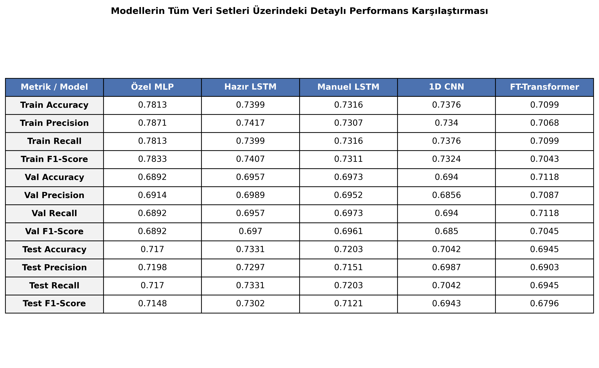
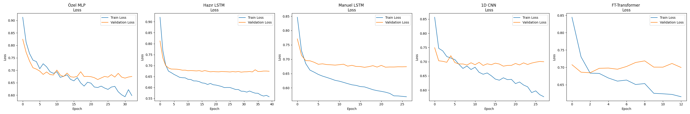
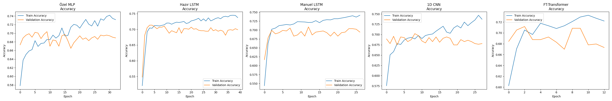
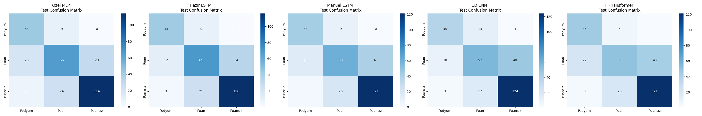

# Grid2Podium: Formula 1 Yarış Sonucu Tahmin Sistemi

Grid2Podium, Formula 1 yarış verilerini analiz ederek pilotların yarış sonu başarılarını (Podyum, Puan veya Puansız) tahmin eden bir derin öğrenme projesidir. Çalışma kapsamında; başlangıç pozisyonu, pist özellikleri ve takım performansı gibi parametreler kullanılarak çeşitli yapay sinir ağı mimarileri üzerinden sonuç tahmini gerçekleştirilmektedir.

## Veri Seti ve Metodoloji
Bu çalışmada kullanılan veriler [Formula 1 Datasets (GitHub)](https://github.com/toUpperCase78/formula1-datasets) üzerinden temin edilmiştir. Veri seti, 2019 ve sonrası sezonları kapsayan yarış sonuçlarını içermekte olup, modellerin eğitimi öncesinde veri temizleme, ölçeklendirme ve kategorik değişken dönüşümleri gibi ön işleme aşamalarından geçirilmiştir.

## Model Performans Analizi
Eğitilen modellerin karşılaştırmalı performans metrikleri aşağıda detaylandırılmıştır:

### Eğitim ve Doğrulama Dinamikleri
Modellerin öğrenme kapasiteleri ve genelleme yetenekleri, kayıp (loss) ve doğruluk (accuracy) grafikleri aracılığıyla analiz edilmiştir:

**Kayıp (Loss) Analizi:**

**Doğruluk (Accuracy) Analizi:**

### Hata Matrisi ve Sınıflandırma Analizi
Modellerin hedef sınıflar üzerindeki tahmin başarısını ve hata dağılımını gösteren test seti konfüzyon matrisleri:

## Uygulanan Model Mimarileri
Proje kapsamında, tablosal veriler üzerinde yüksek performans göstermesi hedeflenen aşağıdaki mimariler özelleştirilerek kullanılmıştır:

*   **Custom MLP:** Batch Normalization ve Dropout regülarizasyonu içeren çok katmanlı algılayıcı mimarisi.
*   **Hazır ve Manuel LSTM:** Zaman serisi ve sıralı veriler için optimize edilmiş, standart kütüphane fonksiyonlarının yanı sıra matematiksel mantığı manuel olarak kodlanmış Uzun Kısa Süreli Bellek mimarileri.
*   **1D CNN:** Veri setindeki yapısal özellikleri yakalamak amacıyla tasarlanmış tek boyutlu evrişimli sinir ağı.
*   **FT-Transformer:** Tablosal verilerde attention mekanizmasının verimliliğini test etmek amacıyla kullanılan mimari.
